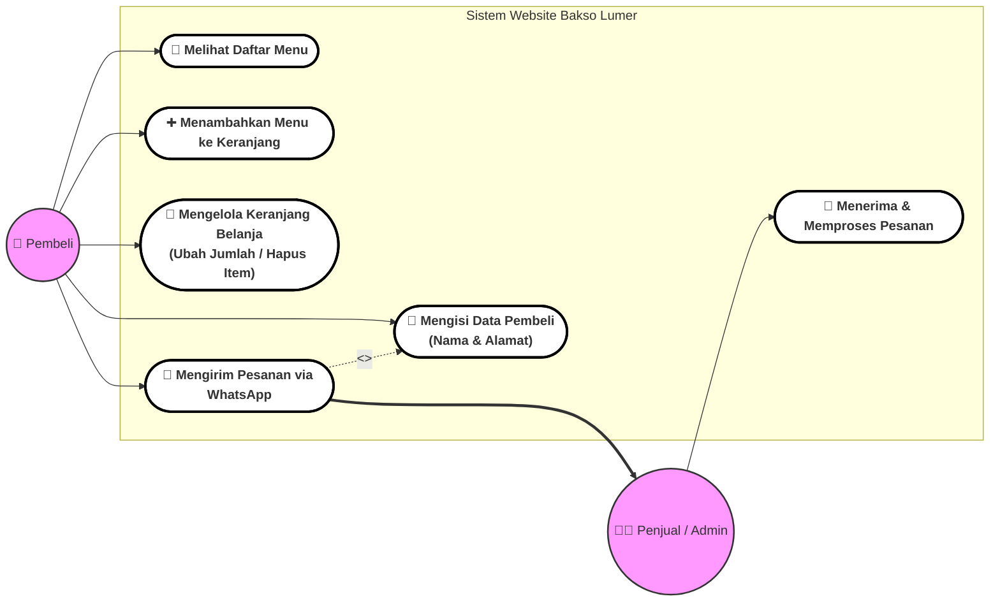
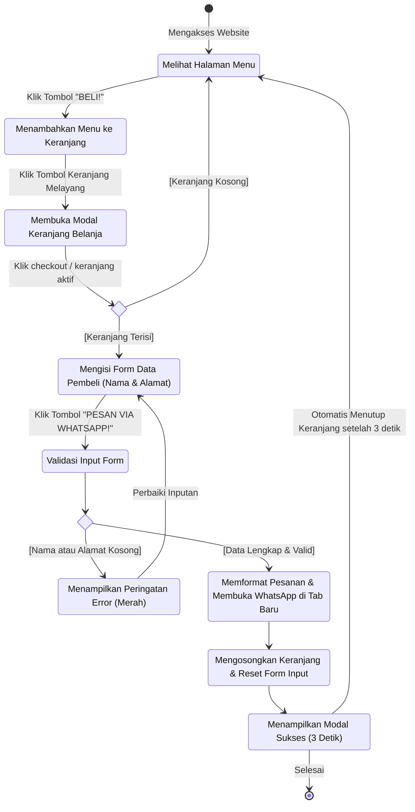

# Dokumen Diagram Sistem: Bakso Lumer

Dokumen ini berisi representasi visual berupa **Use Case Diagram** dan **Activity Diagram** untuk sistem aplikasi web **Bakso Lumer**. Diagram di bawah ini dibuat menggunakan format **Mermaid.js** agar dapat dirender secara dinamis dan terlihat sangat modern dan interaktif.

---

## 1. Use Case Diagram

Use Case Diagram menggambarkan interaksi antara pengguna (*Actor*) dengan fitur-fitur yang disediakan oleh sistem aplikasi web Bakso Lumer.

### Aktor Utama:
1. **Pembeli (Buyer):** Pengguna yang menjelajahi menu, mengelola belanjaan, mengisi data pengiriman, dan mengirim pesanan.
2. **Penjual (Seller / Admin WA):** Penerima pesan orderan di WhatsApp yang memproses pembuatan dan pengiriman makanan.

---

## 2. Activity Diagram

Activity Diagram ini menggambarkan alur kerja (*workflow*) yang terjadi dari awal pembeli berinteraksi dengan menu hingga berhasil mengirimkan pesanan detail ke WhatsApp penjual.

---

## Penjelasan Alur Sistem

### A. Fungsionalitas Use Case:
* **Melihat Daftar Menu:** Pembeli disajikan tampilan kartu menu bergaya komik yang menarik beserta harga, gambar emoji, dan deskripsi produk.
* **Menambahkan Menu ke Keranjang:** Pembeli dapat menekan tombol `BELI!` untuk menyimpan produk ke keranjang belanja lokal.
* **Mengelola Keranjang:** Memungkinkan pembeli melihat total item, menambah/mengurangi kuantitas secara langsung, serta menghapus item yang tidak jadi dibeli.
* **Mengisi Data Pembeli:** Langkah krusial sebelum melakukan pesanan, di mana nama dan alamat wajib diisi sebagai prasyarat pengiriman.
* **Mengirim Pesanan via WhatsApp:** Sistem mengonversi seluruh isi keranjang dan detail pembeli menjadi pesan terstruktur yang disandikan secara aman ke URL WhatsApp Web/App (`wa.me`).

### B. Alur Aktivitas (Activity):
1. Pengguna membuka halaman utama, memilih menu makanan, dan memasukkannya ke dalam keranjang.
2. Ketika membuka modal keranjang, pengguna wajib mengisi formulir **Nama Lengkap** dan **Alamat Lengkap Pengiriman**.
3. Jika pengguna langsung menekan **PESAN VIA WHATSAPP!** tanpa mengisi formulir, sistem akan menampilkan animasi peringatan merah (validasi gagal).
4. Jika validasi berhasil, sistem menyusun teks detail pesanan dengan format rapi (menggunakan spasi, simbol emoji, dan garis pemisah agar mudah dibaca oleh penjual).
5. Aplikasi membuka tab baru untuk mengarahkan pengguna mengirimkan pesan tersebut langsung ke WhatsApp `+62 813-1113-2611`.
6. Pada saat yang sama, status keranjang belanja dan formulir input dibersihkan secara otomatis, serta menampilkan animasi pop-up sukses hijau selama 3 detik sebelum kembali ke halaman menu utama.
